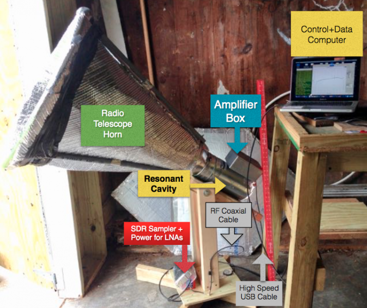

## analyze
### analyize: plotting tools for reviewing/averaging/calibrated spectra line observations from Science Aficionado Telescopes.   
<a href="http://www.gb.nrao.edu/~glangsto/LightWorkMemo014r9.pdf"> </a>

You can use these python programs to view, and understand, observations of our Milky Way galaxy. These observations were made using home-built radio telescopes. These plotting programs expect ascii input spectra in a number of files.  Each file has 
extensive headers describing the observations.

This hub contains python code to analyse Radio Astronomy _Spectra_ and _Event_ observations. The spectral analysis programs are described first, followed by the event detection analysis.

Instructions on building your own telescope is found on the website wiki:
http://opensourceradiotelescopes.org/wk

### Programs:

* S     - Summarize a set of observations.  Function calls s.py
* C     - _Main_ program which calibrates, averages, flags and plots sets of spectra
* R     - Function to call r.py, which plots raw spectra
* T     - Function to plot Calibrated Observations.   Requires both sky observations and a _hot load_ observation of the ground.
* M     - Function to plot Calibrated Observations with baseline subtracted in a frequency expected to be free of neutral hydrogen emission.
* FIX   - Fix parameters in the observing file that were incorrect (like telescope elevation).  Running without arguments provides help.
* E     - Function to plot Event time series.
* FFT   - Function to plot the FFTs of Event time series.  This function also counts events in time ranges.

### Python:

* c.py  - Large python function to calibrate, average, flag and baseline fit observations.
* r.py  - Python function to read and plot the _raw_ spectra
* s.py  - Python function to read all selected spectra in a directory and summarize the observations

Place the programs and python code in the appropriate place for your system.   I often put all these
programs and python code in my _Linux_ computer sub-directory _~/bin_ and update my path with:
```
export PATH=~/bin:$PATH
```
### Data:

* '*.ast' - All astronomical observations have names based on date and end with .ast
* '*.hot' - Calibration requires observations of the ground with assumed temperature of 285 K
* '*.kel' - Calibrated, average observations have extensions based on units.  _kel_ means Kelvins.
<a href="http://www.opensourceradiotelesopes/wk/"> </a>
* '*.eve' - Raw time series samples of events.  The I/Q samples are recorded separately, but I and Q samples alternate in time.

### Directories:
* data      - Selection of data for testing plotting functions.  Small selections of 5 days of observations are provided in the _data_ directory to allow user testing.
* images    - Directory containing images for documenting the useage
* events    - Directory of observations of detected events.

These plotting programs work with spectra created using any of the GnuRadio NsfIntegrate??.grc designs.
The data taking designs were created using the Gnu Radio Companion (GRC) tool.   The programs provided here
are for analysis after the observations, not for data taking.
The observations in directory _data_ were made over 5 days, with a Science Aficionados Horn and an 
<a href="https://www.analog.com/en/design-center/evaluation-hardware-and-software/evaluation-boards-kits/adalm-pluto.html#eb-overview"> ADALM Pluto Software Defined Radio (SDR)</a>.   The Gnuradio data-taking designs (see http://github.com/glangsto/gr-nsf)
were run on an Odroid XU4 octa-core single-board computer.   The observations were setup for 7 MHz
bandwidth. The center frequency was 1421.25 MHz.   The spectra look good and different arms of our Mikly Way Galaxy can be identified
by emission at different velocities and intensities.

FYI, these observations were made to try and detect the Andromeda Galaxy, the spiral galaxy closest to the Milky Way.
I could not confirm that I saw any signs of Andromeda, but with some hardware improvements it should be possible
to see the structure and rotation of Andromeda from your own back yard!

The observations are summarized through the _S_ command.  Ie to summarize observations in the _data_ directory type:
```
S data/*

Count  Time    Az    El   G-Lon G-Lat  Frequency  BW   Gain    Filename
   1 05:01:00   0.0, 70.0 134.5, -2.6:  1421.25, 7.00  15.0 - data/18-11-01T050100.ast 
   8 12:08:31   0.0, 70.0 156.4, 43.2:  1421.25, 7.00  15.0 - data/18-11-01T120831.ast 
   1 05:00:38   0.0, 40.0 123.6, 25.5:  1421.25, 7.00  15.0 - data/18-11-02T050038.ast 
  10 12:09:52   0.0, 40.0 124.2, 27.9:  1421.25, 7.00  15.0 - data/18-11-02T120952.ast 
   1 05:00:59   0.0, 60.0 131.7,  7.1:  1421.25, 7.00  15.0 - data/18-11-03T050059.ast 
   8 12:08:40   0.0, 60.0 143.8, 39.7:  1421.25, 7.00  15.0 - data/18-11-03T120840.ast 
   1 05:00:56   0.0, 50.0 128.0, 16.4:  1421.25, 7.00  15.0 - data/18-11-04T050056.ast 
  27 17:09:42   0.0, 50.0 115.9, 36.8:  1421.25, 7.00  15.0 - data/18-11-05T170942.ast 
   1 17:40:20   0.0,-40.0 170.6,-37.5:  1421.25, 7.00  15.0 - data/18-11-05T174020.hot 
   5 17:49:20   0.0,-40.0 172.6,-35.9:  1421.25, 7.00  15.0 - data/18-11-05T174920.hot 
```
### Support functions

The programs depend on several helper python functions:
    
| code module |               Description    |
| ------------| --------- |
| radioastronomy.py | Python to read and write spectra.  This function is shared with the data collecting software.  |
| interpolate.py    | Python to interpolate over expected Radio Frequency Interference (RFI).  Needed for more acurate calibration. |
| hotcold.py	    | Python to calibrate hot/cold load observations and accumulate averages. |
| angles.py	        | Python to process angle sums and differences |

Put these python programs in the appropriate place for your computer, i.e. in your working directory or in your _~/bin_ directory.

These modules require several python packages, including _numpy_, _statistics_ and _pyephem_. These modules are usually installed with pip.  ie:
```
sudo pip install numpy statistics pyephem
```

## Examples:

These functions may be executed in the current directory. It is better to move all the python programs to  to the appropriate place in your _path_. To plot raw data in a directory type:
```
R data/*
```


These observations are in the _data_ subdirectory. A maximum of 25 spectra will be plotted.


The main calibration program is C.
To create the plot of calibrated observations (shown above) type:
```
C -B -C 4000. data/*
```
C has a number of arguments.  The arguments commonly used are:

| Argument     | Description |
| --------------- | ----------------- |
| -_B_ | Subtract a baseline fit to the observations at the Minimum and Maximum Velocities plotted.  20 channels of observations are selected at the each of the two velocities.   A linear baseline is fit and subtracted. |
| _-C_     | Interpolate over the center channel in the spectrum.  SDRs often create false signals in the exact middle of the spectra. |
| _4000._  | Average spectra for 4000 seconds. The average time must be provided just before the first file name. |
| data/\*  | Plot all observations in the _data_ sub-directory.  Individual files could also be selected. |
| -VA -300 | Set first velocity (km/sec) for selecting the fitting and plotting range. Not used in this example.  |
| -VB 300 | Set second velocity (km/sec) for selecting the fitting and plotting range. |
| -R 1420.406 | Set Reference Frequency (MHz) for computing Doppler shift velocities.  Also not used in this example. |


The averaged, but not calibrated, observations may also be plotted using _C_.  The _-N_ argument indicates no
calibration.   The Hot and Cold load selected spectra are also shown in this case.   To see the uncalibrated data type:

```
C -C -N 4000. data/*
```

The _data_ directory only has a few minutes of observations, at 5 and 12 hours UTC,
on the selected days.

### Guide to calibrating

These programs provide minimal help if executed without arguments.  Ie:

```
% C

C: Calibrate Science Aficionado (NSF) horn observations
Usage: C [options]  <average_seconds> <files>

Where many parameters are optional:
-B Subtract a linear baseline fit to Spectra at Min and Max Velocities
   Min and max default velocities are:  -550.0,   180.0 km/sec
-C Flag the Center channel, using interpolation.
   This removes a strong narrow feature created by many Software Defined Radios (SDRs)
-D Additional Debug printing.
-I Optionally Flag Known Radio Frequency Interference (RFI)
   Note you need to update the c.py program to add your list of Frequencies
   RFI frequencies are Location Dependent
-H <hot load Temperature> Set the effective temperature of the hot load (Kelvins)
-N Not Calibrate.  This mode is used for tests of raw spectra
-O <output directory> Set the output directory for saved files
-R <Reference Frequency> Rest Frequency (MHz) used for Doppler calculations: 1420.406 (MHz)
-S Save average spectra in files.  The Hot and Cold Load averages are saved, too.
   Average spectra have -ave added to their names
   Calibrated spectra have a .kel (for Kelvins) extension
-X Hanning smooth the hot load observation to reduce calibration noise
-T <plot title String> Label for plot
-VA <low velocity> limit to exclude for baseline fitting
-VB <high velocity> limit to exclude for baseline fitting
Where:
   <average_seconds>: Number of seconds of observations to average.
   <average_seconds> is clock time, not observing time, so 3600. gives one plot for each hour
   <files> are Horn Observation files
   <files> must include both data pointed up (.ast) and down (.hot) observations
      All .hot files are assumed to have a system temperature of   285.0 K

 -- Glen Langston (glangsto@nsf.gov), 2018 December 11
```

## Events

The telescopes may be used to detect radio flash events as well as time-average spectral observations.
<a href="images/PeakEvent19Feb17.png"> </a>

There two Event processing programs
* E - Overplot a series of Events
**  To generate the plot at right, type:
```
E events/19-02-17T135825.eve
```

* FFT - To Count events and FFT event time series to search for RFI in the observations. I've not yet seen RFI in the observations, mostly just very short term flashes, < 1 microsecond in duration.
To summarize all events near the time of the Crab Pulsar in the telescope beam on February 17, 2019 type:
```
FFT -si 6.0 -nd 48 -kp 80000. -no "19-FEB-17 Crab Events >6 sigma" ../events/19-02-17T01[01]*.eve
```
Where many FFT arguments are used. These are:
* -sigma number of sigma to count as an event.
* -nd number of parts in a day  (48 means count events every half hour
* -kp kelvinspercount Convert the counts in to Kelvin units
* -note "Note describing the Observations"  for plot title
* List of files to examine.

<a href="images/EventCaptureCenteredOnCrab.png"> </a>

The neutral hydrogen in the galactic plan is seen in these observations,  (only about 1/30 of a second averaging).
The peak intensity is about 10 K, with an RMS of roughly 1 K.

<a href="images/EventCaptureCenteredOnHI.png"> </a>

The counts per hour for the end of February 16, all of February 17 and the beginning of February 18 are
shown in the plot below. Only events detected with signficance greater than 6 sigma are counted:

<a href="images/EventCapture6Sigma-Compare_16+17+18.png"> </a>

### Glen Langston, National Science Foundation (GIL - 2018 February 26)
