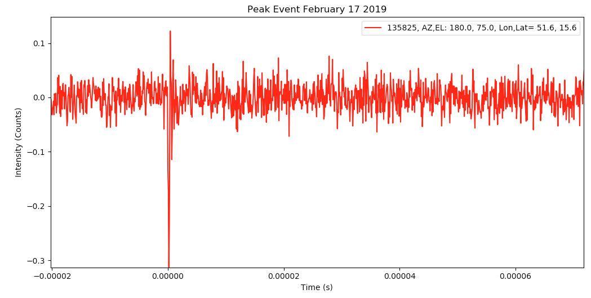

## analyze
### analyize: plotting tools for reviewing/averaging/calibrated spectra line observations from Science Aficionado Telescopes.   
<a href="http://www.gb.nrao.edu/~glangsto/LightWorkMemo014r9.pdf"> </a>

You can use these python programs to view, and understand, observations of our Milky Way galaxy. These observations were made using home-built radio telescopes. These plotting programs expect ascii input spectra in a number of files.  Each file has 
extensive headers describing the observations.

This hub contains python code to analyse Radio Astronomy _Spectra_ and _Event_ observations. The spectral analysis programs are described first, followed by the event detection analysis.

Instructions on building your own telescope is found on the LightWork website:
https://github.com/WVURAIL/lightwork

### Programs:

* S     - Summarize a set of observations.  Function calls s.py
* R     - Function to call r.py, which plots raw spectra
* T     - Function to plot Calibrated Observations.   Requires both sky observations and a _hot load_ observation of the ground.
* FIX   - Fix parameters in the observing file that were incorrect (like telescope elevation).  Running without arguments provides help.
* E     - Function to plot Event time series.
* MATCH - Matches events from Multiple Telescopes.  Producea a plot counts events in time ranges.

### Python:

* t.py  - Large python function to calibrate, average, flag and baseline fit observations.
* r.py  - Python function to read and plot the _raw_ spectra
* s.py  - Python function to read all selected spectra in a directory and summarize the observations

Place the programs and python code in the appropriate place for your system.   I often put all these
programs and python code in my _Linux_ computer sub-directory _~/bin_ and update my path with:
```
export PATH=~/bin:$PATH
```
### Data:

* '*.ast' - All astronomical observations have names based on date and end with .ast
* '*.hot' - Calibration requires observations of the ground with assumed temperature of 285 K
* '*.kel' - Calibrated, average observations have extensions based on units.  _kel_ means Kelvins.
<a href="http://www.opensourceradiotelesopes/wk/"> </a>
* '*.eve' - Raw time series samples of events.  The I/Q samples are recorded separately, but I and Q samples alternate in time.

### Directories:
* data      - Selection of data for testing plotting functions.  Small selections of 5 days of observations are provided in the _data_ directory to allow user testing.
* events    - Directory of observations of detected events.

These plotting programs work with spectra created using any of the GnuRadio NsfIntegrate??.grc designs.
The data taking designs were created using the Gnu Radio Companion (GRC) tool.   The programs provided here
are for analysis after the observations, not for data taking.
The observations in directory _data_ were made over 5 days, with a Science Aficionados Horn and an 
<a href="https://www.analog.com/en/design-center/evaluation-hardware-and-software/evaluation-boards-kits/adalm-pluto.html#eb-overview"> ADALM Pluto Software Defined Radio (SDR)</a>.   The Gnuradio data-taking designs (see http://github.com/glangsto/gr-nsf)
were run on an Odroid XU4 octa-core single-board computer.   The observations were setup for 7 MHz
bandwidth. The center frequency was 1421.25 MHz.   The spectra look good and different arms of our Mikly Way Galaxy can be identified
by emission at different velocities and intensities.

FYI, these observations were made to try and detect the Andromeda Galaxy, the spiral galaxy closest to the Milky Way.
I could not confirm that I saw any signs of Andromeda, but with some hardware improvements it should be possible
to see the structure and rotation of Andromeda from your own back yard!

The observations are summarized through the _S_ command.  Ie to summarize observations in the _data_ directory type:
```
S data/*

Count  Time    Az    El   G-Lon G-Lat  Frequency  BW   Gain    Filename
   1 05:01:00   0.0, 70.0 134.5, -2.6:  1421.25, 7.00  15.0 - data/18-11-01T050100.ast 
   8 12:08:31   0.0, 70.0 156.4, 43.2:  1421.25, 7.00  15.0 - data/18-11-01T120831.ast 
   1 05:00:38   0.0, 40.0 123.6, 25.5:  1421.25, 7.00  15.0 - data/18-11-02T050038.ast 
  10 12:09:52   0.0, 40.0 124.2, 27.9:  1421.25, 7.00  15.0 - data/18-11-02T120952.ast 
   1 05:00:59   0.0, 60.0 131.7,  7.1:  1421.25, 7.00  15.0 - data/18-11-03T050059.ast 
   8 12:08:40   0.0, 60.0 143.8, 39.7:  1421.25, 7.00  15.0 - data/18-11-03T120840.ast 
   1 05:00:56   0.0, 50.0 128.0, 16.4:  1421.25, 7.00  15.0 - data/18-11-04T050056.ast 
  27 17:09:42   0.0, 50.0 115.9, 36.8:  1421.25, 7.00  15.0 - data/18-11-05T170942.ast 
   1 17:40:20   0.0,-40.0 170.6,-37.5:  1421.25, 7.00  15.0 - data/18-11-05T174020.hot 
   5 17:49:20   0.0,-40.0 172.6,-35.9:  1421.25, 7.00  15.0 - data/18-11-05T174920.hot 
```
### Support functions

The programs depend on several helper python functions:
    
| code module |               Description    |
| ------------| --------- |
| radioastronomy.py | Python to read and write spectra.  This function is shared with the data collecting software.  |
| interpolate.py    | Python to interpolate over expected Radio Frequency Interference (RFI).  Needed for more acurate calibration. |
| hotcold.py	    | Python to calibrate hot/cold load observations and accumulate averages. |
| angles.py	        | Python to process angle sums and differences |

Put these python programs in the appropriate place for your computer, i.e. in your working directory or in your _~/bin_ directory.

These modules require several python packages, including _numpy_, _statistics_ and _pyephem_. These modules are usually installed with pip.  ie:
```
sudo pip install numpy statistics pyephem
```

## Examples:

These functions may be executed in the current directory. It is better to move all the python programs to  to the appropriate place in your _path_. To plot raw data in a directory type:
```
R data/*
```


These observations are in the _data_ subdirectory. A maximum of 25 spectra will be plotted.


The main calibration program is T.
To create the plot of calibrated observations (shown above) type:
```
T -B -C 3600. data/*
```
T has (too) many arguments.  The arguments commonly used are:

| Argument     | Description |
| --------------- | ----------------- |
| -_B_ | Subtract a baseline fit to the observations at the Minimum and Maximum Velocities plotted.  20 channels of observations are selected at the each of the two velocities.   A linear baseline is fit and subtracted. |
| _-C_     | Interpolate over the center channel in the spectrum.  SDRs often create false signals in the exact middle of the spectra. |
| _3600._  | Average spectra for 4000 seconds. The average time must be provided just before the first file name. |
| data/\*  | Plot all observations in the _data_ sub-directory.  Individual files could also be selected. |
| -VA -300 | Set first velocity (km/sec) for selecting the fitting and plotting range. Not used in this example.  |
| -VB 300 | Set second velocity (km/sec) for selecting the fitting and plotting range. |


The Hot and Cold load selected spectra are also shown in this case.   To see the uncalibrated data type:

```
R data/*
```

The _data_ directory only has a few minutes of observations, at 5 and 12 hours UTC,
on the selected days.

### Guide to selecting and averaging spectra.

These programs provide minimal help if executed without arguments.  Ie:

```
% T

T: Comput Tsys calibrated horn observations
Usage: T [-F <order>] [-L <velocity>] [-H <velocity>] <_seconds> <files>
Where <seconds>: Number of seconds of observations to average.
-A <hot file> <cold file> use save hot and cold load files
-B optionally plot/keep the baseline subtratcted spectra
-C optionally flag the center of the band
-D optionally print extra debugging info
-E optionally to not estimate Barycentric Velocity offset
-F <order> optionally do a polynomial baseline fit
-G <halfwidth> median filter the output vector
-H optionally set the high velocity region for baseline fit
-I optionally set Processor/Telescope Index on Plot Label
-K <directory> keep average hot and cold load calibration files
-L optionally set the low velocity region for baseline fit
-N <number> optionally set the number of spectra to plot
-M Skip writing header for .kel files
-O <AzOffset> <ElOffset> Add offsets to input Az,El
-P <dir> write PNG and PDF files instead of showing plot
-Q optionally plot intensity versus freQuency, instead of velocity
-R optionally flag known RFI lines
-S <filename> optionally set summary file name
-T <Plot Title> optionally set the plot title
-U <freqMHz> optionally set reference frequency for different line
   ie -U 1612.231, 1665.402, 1667.349, 1720.530 or 1420.40575
-V Limit ascii file putput to low and high velocity ranges
-W optionally write the calibrated Tsys files (kelvins)
-X <temp> optionally set Cold Load Temperature (Kelvins)
-Y <temp> optionally set Hot  Load Temperature (Kelvins)
-Z <file tag> optionally add tag to PDF and PNG file names
-0 optionally plot zero intensity line(s)
-MINEL optionally set the lowest elevation allowed for calibration obs (default 60d)
Observation file list must include at least one hot load file

Where:
   <average_seconds>: Number of seconds of observations to average.
   <average_seconds> is clock time, not observing time, so 3600. gives one plot for each hour
   <files> are Horn Observation files
   <files> must include both data pointed up (.ast) and down (.hot) observations
      All .hot files are assumed to have a system temperature of   285.0 K

 -- Glen Langston (glangsto@nsf.gov), 2024 March 11
```

## Events

Horn Telescopes are used to detect very short term, _Flash_, events.  The software to investigate
these events are described in the eventnotes directory
<a href="eventnotes/README.md"> </a>

### Glen Langston, National Science Foundation (GIL - 2024 March 11)
