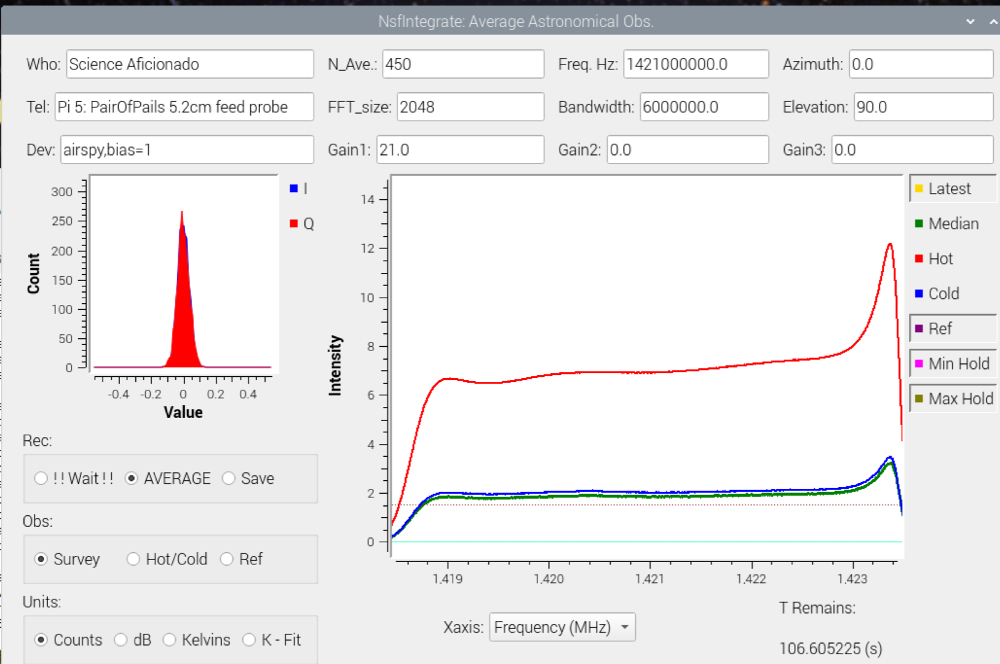
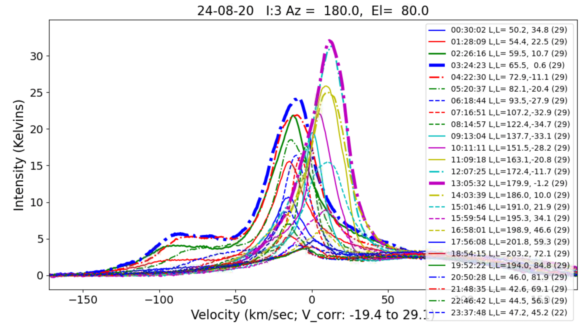
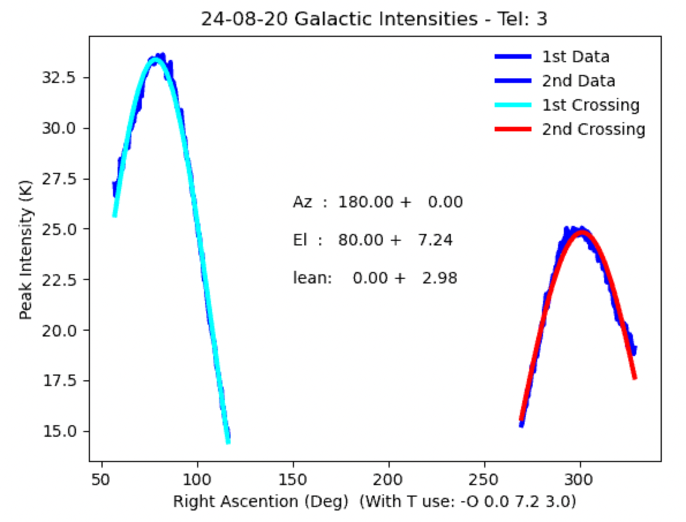
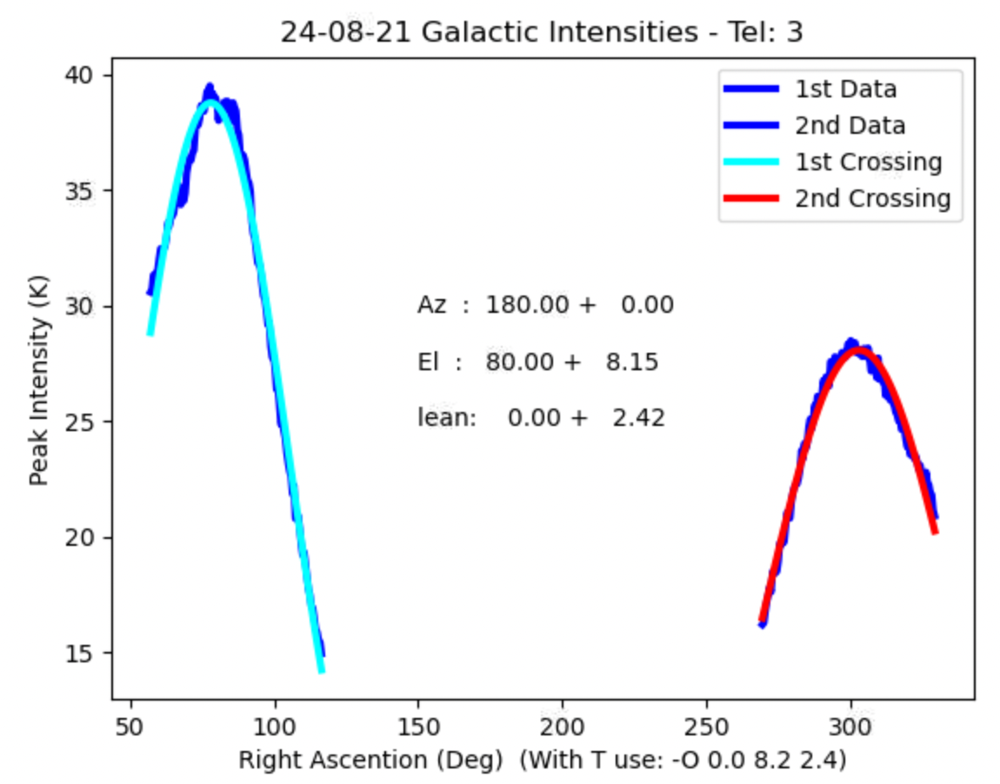

## fitCrossing.py

 
### fitCrossing.py: Takes 24 hours of transit horn radio telescope, spectral line summary, observations and estimate the horn telescope pointirng offset based on Galactic Plane Crossing times.

One goal of the horn radio telescope project is to eable making a whole-sky, Milky Way Map of the structure of our Galaxy.   The map is based on Hydrogen Spectral LIne observations, made with small, low cost, but extreemly power radio telescopes.   This is a great learning project, but there are a few steps required to make a beautiful map of our Galaxy.

Our process for making a picture of the whole galaxy, is to make a series of 13 whole day observations.   Each day moving the telescope to a new pointing direciton.  There are usually some errors in measuring the telescope pointing direction.   To make the best quality map, its valuable to estimate the pointing errors, so that they can be used to add <it>pointing offsets</it>.
Several steps are required to use the program to fit the pointing offsets from the observatoins.   The first step is making a calibration observation with your telescope.  This is done by pointing your telescope straight up and observating for about 4 hours.   This is followed by pointing your telescope down, towards the ground and observing for another 4 (or more) hours.

Next compute the average spectra for calibration.  These are used for all subsequent calibration, until you make a change in the telescope hardware, such as swapping the amplifiers, software defined radio or shape of the horn.

Use the "T" command in analyze, with the -K parameter, for Keeping the calibration files.
I created a directory ~/keep and put the calibration files there.

This directory contains the keep hot and cold load spectra for my telescope 3 based on observations on 24 August 7 and 20.  The .ast file is the cold load, the average observation of the sky and the .hot file is the average hours of observing the ground.

Then observe the sky for 24 hours with your telescope parked at your prefered azimuth and elevation. I usually make 2 minute averages of spectra, which produces about 720 spectra a day.   These files will accumulate in the ~/data directory.

 
Pi3-FitCrossing-Output-24Aug20.png 

### Glen Langston, National Science Foundation (GIL - 2024 August 22)
